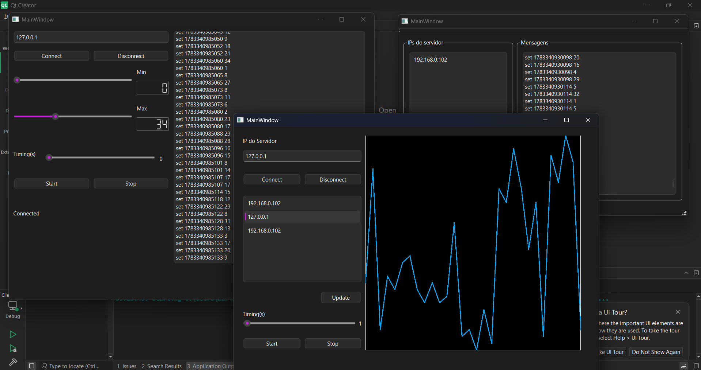
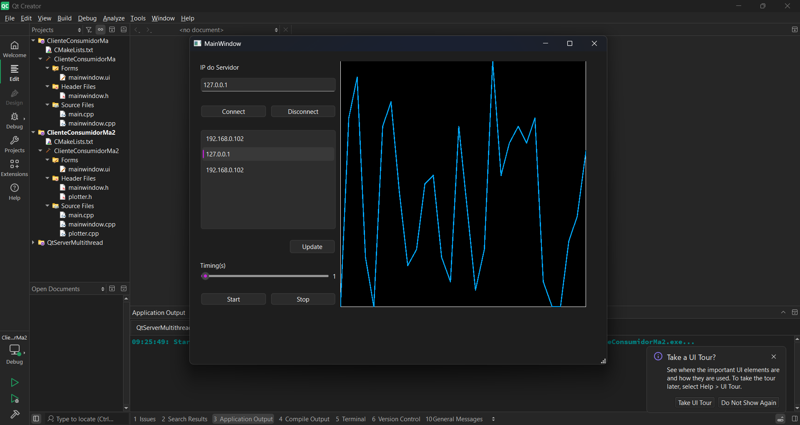

# Projeto3-Supervisorio-Qt
# Projeto 3: Sistema de Aquisição e Supervisão de Dados (Qt/C++)

Este repositório contém a implementação dos módulos **Cliente Produtor** e **Cliente Consumidor** para um sistema supervisório de dados via rede (TCP/IP). O projeto foi desenvolvido em **C++** utilizando o framework **Qt** (via Qt Creator), como parte da avaliação da disciplina de Programação Avançada.

O sistema simula um ambiente de aquisição de dados, onde máquinas geram medições (Produtor) que são enviadas a um roteador central (Servidor), e posteriormente lidas e plotadas graficamente por uma central de monitoramento (Consumidor).

## 🏗️ Arquitetura do Sistema

O projeto é composto por três módulos que se comunicam através da porta TCP `1234`:

1. **Servidor TCP** *(Fornecido pelo professor)*: Atua como o roteador de mensagens. Recebe os dados gerados, armazena em memória e responde às requisições de listagem e envio.
2. **Cliente Produtor** *(Implementado)*: Conecta-se ao servidor e envia medições aleatórias de tempo e valor (simulando um sensor) com base em limites de máximo/mínimo configuráveis.
3. **Cliente Consumidor** *(Implementado)*: Conecta-se ao servidor, lista os IPs dos produtores ativos e desenha um gráfico dinâmico em tempo real das últimas 30 amostras geradas pela máquina selecionada.

---

## ✨ Funcionalidades Implementadas

### Módulo Produtor
- Conexão e desconexão com IP dinâmico.
- Botões `Put` (iniciar envio) e `Stop` (parar envio).
- Sliders para controle dinâmico do **Valor Mínimo** e **Valor Máximo** dos dados gerados.
- Slider de **Timing** para controlar o intervalo (em segundos) entre os envios dos dados.

### Módulo Consumidor
- Conexão e desconexão com IP dinâmico.
- Botão `Update` para requisitar e listar os IPs dos produtores ativos na rede.
- Seleção de máquina específica através de um `QListWidget`.
- Botões `Start` e `Stop` para controlar a leitura dos dados.
- Slider de **Timing** para ajustar o intervalo de requisição dos dados.
- **Gráfico Customizado (Classe Plotter):** Um widget promovido, construído do zero, que ajusta automaticamente a escala (X e Y) e plota as linhas ligando os pontos de dados recebidos dinamicamente no evento de pintura (`paintEvent`).

---
## 📸 Demonstração Visual

### Visão Geral do Sistema (Servidor, Produtor e Consumidor)

### Detalhe do Gráfico (Consumidor)

---
